<a id="top"></a>
<div align="center">


<br>


<p></p>

<h1>🎙️ AC Engineer Sally</h1>

<p><strong>Você pilota. Sally acompanha.</strong><br>
Engenheira de corrida e spotter automáticos para <strong>Assetto Corsa + CSP</strong>.<br>
Voz gravada, telemetria ao vivo e uma central para acompanhar seu stint.</p>

<p>
<a href="#install"></a>
<a href="https://github.com/Silxyst/AC-Engineer-Sally/issues"></a>
</p>

<p>


<a href="LICENSE"></a>
<a href="https://github.com/Silxyst/AC-Engineer-Sally/stargazers"></a>
</p>

<p><a href="#features">✨ Recursos</a> · <a href="#radio">📻 O rádio</a> · <a href="#install">📥 Instalação</a> · <a href="#settings">🎛️ Ajustes</a> · <a href="#faq">❓ FAQ</a> · <a href="#credits">📜 Créditos</a></p>
<p>🇧🇷 <strong>Português</strong> · <a href="docs/README.en.md">🇬🇧 English</a></p>

</div>

> 🏁 **Comece aqui:** baixe o projeto com **Git LFS**, copie `AC-Engineer-Sally` para `assettocorsa/apps/lua/`, ative o app no CSP e faça um **Radio check** nos ajustes.

<a id="features"></a>
## ✨ Uma equipe no seu ouvido

<table>
<tr>
<td width="50%" valign="top">
<h3>👀 Spotter de proximidade</h3>
<p>Carros à esquerda e à direita, sobreposição, três lado a lado e pista livre. Chamadas do spotter têm prioridade sobre o relatório da engenheira.</p>
</td>
<td width="50%" valign="top">
<h3>⛽ Combustível e estratégia</h3>
<p>Consumo aprendido por volta, autonomia, reserva e projeção para a chegada. Avisos ajudam a acompanhar o tanque durante o stint.</p>
</td>
</tr>
<tr>
<td valign="top">
<h3>🌡️ Saúde do carro</h3>
<p>Temperatura e pressão dos pneus, desgaste, danos e motor, conforme a telemetria disponibilizada pelo carro e pelo CSP.</p>
</td>
<td valign="top">
<h3>🚩 Leitura da corrida</h3>
<p>Bandeiras, posição, gaps, entrada e saída do box, relógio da sessão e penalidades reportadas pelo simulador.</p>
</td>
</tr>
<tr>
<td valign="top">
<h3>📊 Central de corrida</h3>
<p>Combustível, autonomia, voltas restantes, última e melhor volta, pneus e histórico do rádio em uma janela dedicada.</p>
</td>
<td valign="top">
<h3>🌍 Do seu jeito</h3>
<p>Interface e legendas em PT-BR ou inglês, volumes separados e ajustes de voz. O áudio Sally é gravado em inglês e roda localmente.</p>
</td>
</tr>
</table>

### Mais detalhes que fazem diferença

- **Rádio organizado:** fila com prioridades, prazo de validade e cooldowns para os avisos.
- **Chuva e recursos do carro:** alertas de condições, DRS, ERS e push-to-pass quando os dados correspondentes estiverem disponíveis.
- **Teste direto no app:** Radio check, testes do spotter, sequência de chamadas e catálogo de frases.
- **Preferências locais:** seus ajustes ficam em `user_settings.ini` e são preservados entre usos.
- **Pack incluído:** 25 categorias e **5.952 WAVs Sally**, armazenados com Git LFS.

<a id="radio"></a>
## 📻 Da telemetria ao rádio



Sally lê a situação, aplica os gatilhos dos avisos e organiza as falas. Ao detectar um carro ao lado, o **spotter ganha prioridade**. As legendas acompanham a reprodução.

| Janela | O que você encontra |
|:---|:---|
| **AC Engineer Sally** | Caixa compacta de rádio com a legenda da chamada atual. |
| **AC Engineer Sally — Central de Corrida** | Cartões de telemetria, pneus, status do spotter, histórico e botão de rádio ligado/desligado. |
| **Settings / Ajustes** | Idioma, áudio, avisos, testes e catálogo; acessível pelos ajustes da janela principal. |


<a id="install"></a>
## 📥 Instalação

### Requisitos

- **Assetto Corsa** no Windows.
- **Custom Shaders Patch** com suporte a Lua Apps ativo.
- **Git + Git LFS** para baixar o pack de voz deste repositório.

### 1️⃣ Baixe o app completo

Em uma pasta de sua escolha, execute:

```powershell
git lfs install
git clone https://github.com/Silxyst/AC-Engineer-Sally.git
```

Para garantir que os áudios foram baixados:

```powershell
git -C "AC-Engineer-Sally" lfs pull
```

> 💡 Os WAVs usam **Git LFS**. O comando acima baixa os áudios reais; um ZIP de código-fonte pode conter apenas ponteiros para esses arquivos. Para ouvir Sally, o pack precisa estar completo.

### 2️⃣ Copie para o Assetto Corsa

Com o jogo fechado, copie a pasta `AC-Engineer-Sally` para:

```text
assettocorsa/
└── apps/
    └── lua/
        └── AC-Engineer-Sally/
            ├── AC-Engineer-Sally.lua
            ├── manifest.ini
            ├── config.ini
            └── audio/
                ├── sally/
                └── sfx/
```

A pasta e o arquivo de entrada devem manter o nome **`AC-Engineer-Sally`**.

### 3️⃣ Ative e faça o primeiro teste

1. No Content Manager, confira se **CSP → Lua Apps** está habilitado e ative **AC Engineer Sally** na lista de apps.
2. Entre em uma sessão e abra a janela principal pela barra de apps.
3. Abra **Settings / Ajustes**, escolha **Português** ou **English** e clique em **Radio check**.
4. Ajuste os volumes da engenheira e do spotter e abra a **Central de Corrida**.
5. Vá para a pista: as chamadas de corrida são automáticas.

<a id="settings"></a>
## 🎛️ Ajuste o rádio ao seu estilo

| Ajuste | Para que serve |
|:---|:---|
| **Português / English** | Muda a interface e as legendas; a voz Sally permanece em inglês. |
| **Engenheira / Spotter** | Volumes independentes para relatórios e chamadas de proximidade. |
| **Chiado / Beep** | Ajusta o fundo de rádio e o sinal das mensagens. |
| **Velocidade / Pitch** | Ajusta a reprodução dos clips. |
| **Bandeiras, combustível, pneus e danos** | Liga ou desliga os respectivos grupos de avisos. |
| **Resumo e frequência** | Define os resumos por volta e o intervalo do status de combustível. |
| **Reserva** | Define a margem de combustível em voltas para o cálculo de estratégia. |
| **Rants · 0–3** | Ajusta as reações opcionais de Sally; o padrão distribuído é `0` (desligado). |

`config.ini` fornece os valores iniciais. Alterações feitas no app são salvas em **`user_settings.ini`**, que tem prioridade sobre os padrões e fica fora do Git.

Alguns clips do pack contêm linguagem explícita, incluindo as reações opcionais de Sally.

<a id="faq"></a>
## ❓ Perguntas frequentes

<details>
<summary><strong>🔇 Sally não está falando. O que conferir?</strong></summary>
<br>
Abra os ajustes e faça um <strong>Radio check</strong>. Confira os volumes, o botão de rádio na Central e a pasta <code>audio/sally/</code>. Se baixou um ZIP, confirme que os WAVs são áudios reais, e não ponteiros LFS. Execute <code>git -C "AC-Engineer-Sally" lfs pull</code> na cópia clonada e copie os arquivos completos para o app.
</details>

<details>
<summary><strong>🇧🇷 Posso ouvir Sally em português?</strong></summary>
<br>
A voz gravada é em <strong>inglês</strong>. A seleção <strong>Português / English</strong> muda a interface e as legendas.
</details>

<details>
<summary><strong>📡 Preciso de internet para usar o app?</strong></summary>
<br>
Depois do download, o app usa telemetria do simulador e arquivos locais. A execução é <strong>offline</strong>.
</details>

<details>
<summary><strong>🏎️ Todos os carros terão os mesmos avisos?</strong></summary>
<br>
Os avisos dependem dos recursos e da telemetria expostos pelo carro, pelo mod e pelo CSP. DRS, ERS, desgaste, motor, clima e penalidades exigem os dados correspondentes.
</details>

<details>
<summary><strong>⛽ Por que o consumo começa sem estimativa?</strong></summary>
<br>
Sally aprende o consumo conforme você completa voltas. Quando o simulador fornece uma estimativa inicial, ela também pode ser usada. Dê tempo ao app para reunir amostras.
</details>

<details>
<summary><strong>🎙️ Como o spotter divide o rádio com a engenheira?</strong></summary>
<br>
As chamadas de proximidade têm prioridade e podem interromper um relatório para informar o tráfego ao seu lado.
</details>

<details>
<summary><strong>📁 Como atualizo sem perder meus ajustes?</strong></summary>
<br>
Atualize a cópia clonada com <code>git pull</code> e <code>git lfs pull</code>, feche o jogo e copie os arquivos atualizados para a instalação. Preserve o <code>user_settings.ini</code> local.
</details>

<a id="contribute"></a>
## 🤝 Feito para a comunidade

Encontrou um problema ou tem uma ideia? [Abra uma Issue](https://github.com/Silxyst/AC-Engineer-Sally/issues/new).

Para ajudar a reproduzir, inclua **versão do CSP, carro/mod, pista, tipo de sessão, o que aconteceu e o que você esperava**. Prints e trechos relevantes do log também ajudam.

<details>
<summary><strong>🛠️ Estrutura para quem quer contribuir</strong></summary>

| Módulo | Responsabilidade |
|:---|:---|
| `AC-Engineer-Sally.lua` | Entrada CSP, configurações, ciclo de atualização e janelas. |
| `tele.lua` / `strat.lua` | Telemetria e cálculos de consumo, ritmo e stint. |
| `spot.lua` / `warn.lua` | Proximidade e gatilhos dos avisos automáticos. |
| `sally.lua` / `voice.lua` / `rep.lua` | Leitura do pack, fila de áudio e composição das falas. |
| `ui.lua` / `lang.lua` | Interface e localização PT-BR/EN. |

Após alterar Lua, valide a sintaxe e as referências de áudio. Confira o comportamento em uma sessão CSP: spotter, interrupções do rádio, troca de idioma, bandeiras e saída do box.

</details>

<a id="credits"></a>
## 📜 Créditos e licença

- **Projeto indie:** [Silxyst](https://github.com/Silxyst) · AC Engineer Sally.
- **Código:** [Apache License 2.0](LICENSE).
- **Voz Sally:** pack criado com [crew-chief-autovoicepack](https://github.com/cktlco/crew-chief-autovoicepack); atribuição e termos dos assets em [NOTICE](NOTICE).
- **Plataforma:** Assetto Corsa e Custom Shaders Patch.

<div align="center">

<p><strong>Gostou de ter Sally no rádio? Deixe uma ⭐!</strong><br>
<a href="https://github.com/Silxyst/AC-Engineer-Sally/stargazers">⭐ Estrelas</a> ·
<a href="https://github.com/Silxyst/AC-Engineer-Sally/issues">🐛 Issues</a> ·
<a href="https://github.com/Silxyst/AC-Engineer-Sally/pulls">🤝 Contribuições</a></p>
<sub>Feito para a comunidade de Assetto Corsa · <a href="#top">voltar ao topo ↑</a></sub>
</div>
